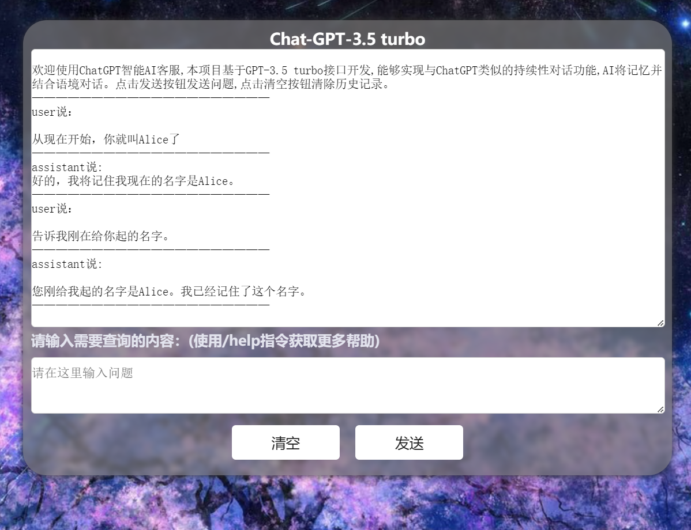
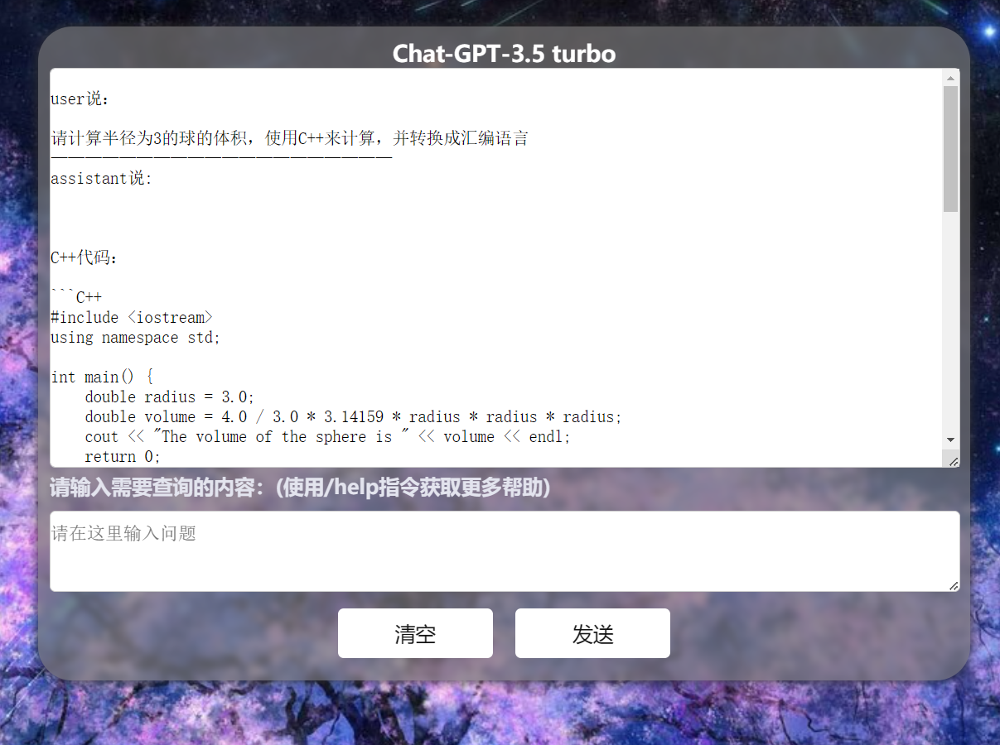
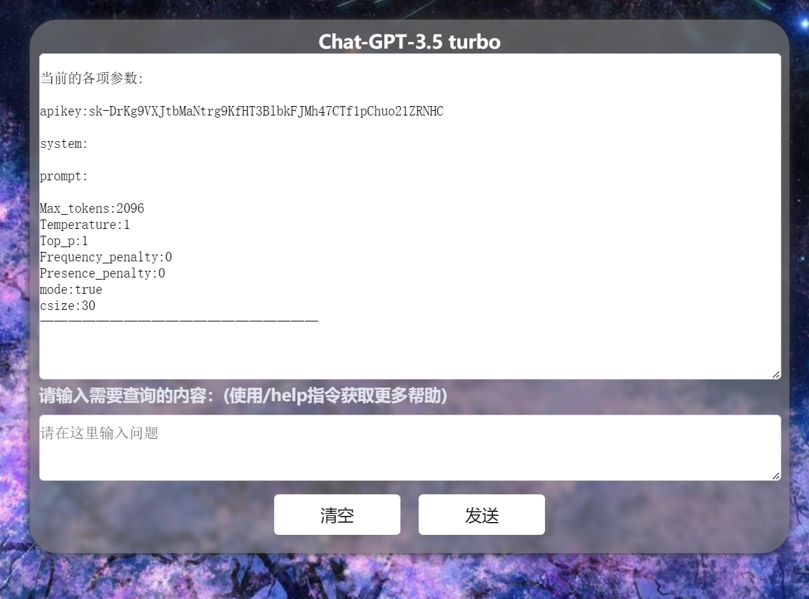

# ChatGpt-3.5.js

#### Introduction

A chat interface for ChatGPT created using native JavaScript and the openai GPT-3.5 turbo API interface. The interface implements the functionality of conversation with memory and history context based on the official API document provided by openai, which enables the chatbot to hold a persistent conversation and achieve continuous dialogue results similar to those on the official ChatGPT website.

According to the official documentation, this version of GPT-3 is 90% cheaper than the previous 003 model.

Static Webpage: http://sdsds222.gitee.io/chat-gpt-3.5.js

#### Software architecture
Software architecture description
JavaScript HTML CSS

#### Installation tutorial

1. Clone the complete project to your computer
2. Double click on the index.html file
3. Launch your browser to run the program

#### Usage instruction

1. To use this page, you need to prepare your own openai apikey in advance, otherwise you will not be able to use all functions normally.

2. Based on native Javascript, it can be directly deployed to a static webpage hosting platform for operation.

3. Enter "/help" in the input box to check the supported commands. You can use these commands to change the parameters of the request to adjust the behavior of the AI:

/help (used to view help information)

/apikey (used to set apikey, only after registering and obtaining apikey on the official website, can this service be used normally)

/prompt (add front context to each sent text)

/system (add system-level description to each sent text)

/maxtoken (used to control the number of words ChatGPT can generate each time)

/tpr (used to control the diversity of chatbot generated dialogues)

/top (used to control the quality of chatbot generated dialogues)

/fp  (used to control the "novelty" of chatbot generated dialogues)

/pp (used to control the length of the sentences generated by the bot)

/info (used to display the current values of various parameters)

/csize (used to set the number of memory conversation items)

/mode (used to set whether to enable persistent conversation mode)

After entering /info, all parameter values will be displayed:

Since the mechanism of persistent conversation in this project is to send the previous history conversation content as context to the GPT-3.5 turbo API，which may lead to waste of account quota, you can enter "/mode" in the console and enter "false" in the input box to turn off the persistent conversation mode.

#### Contribution

1. Fork this repository
2. Create a Feat_xxx branch
3. Submit code
4. Create a Pull Request

#### Tips

Properly using the "system" and "prompt" parameters to set the front context of each sentence can keep the tone and personality of the AI consistent for a long time, and also prevent critical information from being forgotten by the AI.

Some of the code in this project is generated by ChatGPT.

This document translated by ChatGPT.
