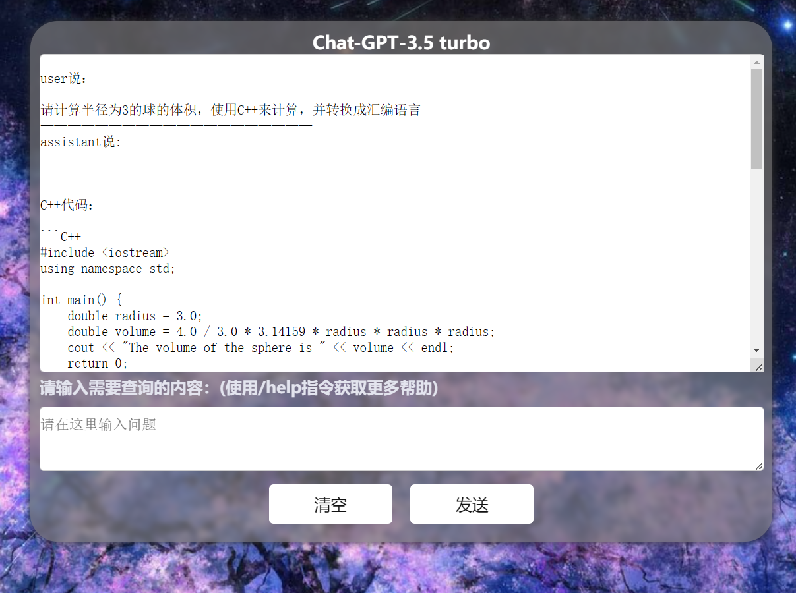

# ChatGpt-3.5.js

#### 介绍
一个用原生JavaScript和编写的ChatGPT聊天界面，基于openai的GPT-3.5 turbo API接口实现，
并使用官方接口文档提供的方案实现了记忆历史对话上下文的功能，使其可以持续对话，可实现与官网ChatGPT接近的持续性对话效果。

静态网页：http://sdsds222.gitee.io/chat-gpt.js/

#### 软件架构
软件架构说明
Javascript HTML CSS

#### 安装教程

1.  将完整项目克隆到电脑
2.  双击index.html文件
3.  启动浏览器运行

#### 使用说明

1.  要使用该页面需要提前自备openai的apikey，否则将无法正常使用所有功能。
2.  基于原生Javascript，可直接部署到静态网页托管平台运行。
3.  在输入框输入“/help”即可查看支持的指令,可通过这些指令来更改发送请求的参数以调整AI的行为：
/help （用于查看帮助信息）
/apikey  (用于设置apikey,只有在官网注册获取apikey才能正常使用本服务)
/prompt  (为每次发送的文本添加前置上下文)
/system  (为每次发送的文本添加系统级描述)
/maxtoken  (用于控制ChatGPT每次能生成的词数)
/tpr (可以用来控制chatbot生成的话的多样性)
/top  (可以用来控制chatbot生成的话的质量)
/fp  (可以用来控制chatbot生成的话的“新颖程度”)
/pp  (用于控制bot产生的句子的长度)
/info  (用于显示当前各项参数的值)
/csize  (用于设置记忆历史对话的条数)
/mode  (用于设置是否启用持续对话模式)

输入/info后，将显示所有参数的值：

由于本项目能够持续对话的原理是将之前的历史对话内容作为上下文语境也一并发送给GPT-3.5 turbo 的接口，这可能会导致账户额度的浪费，可以在控制台输入“/mode”并在输入框输入“false”来关闭持续对话模式。

#### 参与贡献

1.  Fork 本仓库
2.  新建 Feat_xxx 分支
3.  提交代码
4.  新建 Pull Request

#### 特技

合理利用system和prampt参数来设置每句话的前置上下文，可以使AI的语气和性格长期保持一致，也可以使关键信息不被AI忘记。

本项目中有一部分代码由ChatGPT生成。

